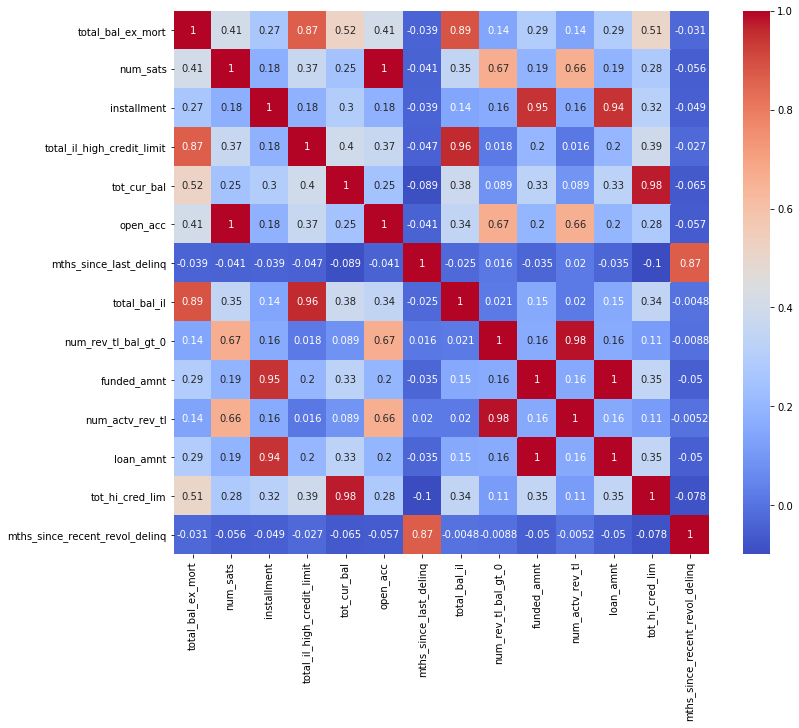
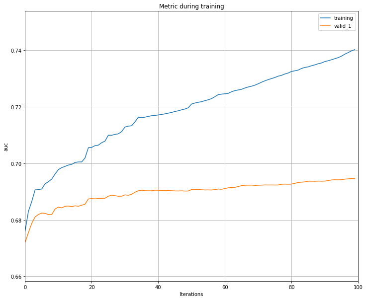
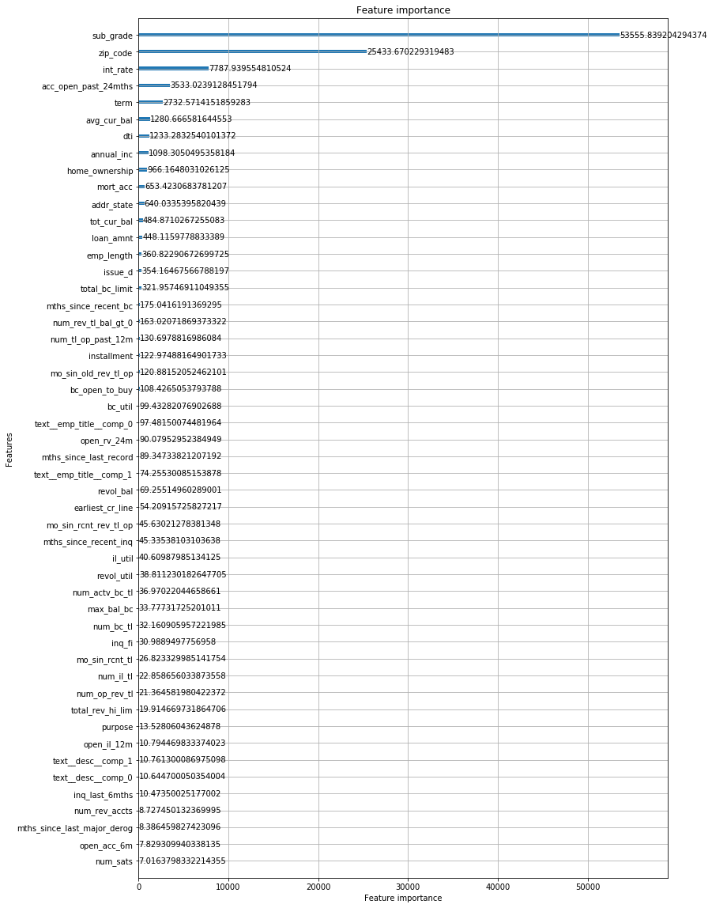

```python
import logging 
import feather
import sys
import datetime
import time
import os
from pathlib import Path
import gc
from collections import Counter
import codecs

import warnings
warnings.filterwarnings("ignore")
warnings.filterwarnings("ignore",category=DeprecationWarning)

import numpy as np
import pandas as pd
from sklearn.model_selection import train_test_split
from sklearn.ensemble import RandomForestClassifier

import matplotlib
import matplotlib.pyplot as plt
import seaborn as sns
%matplotlib inline
```


```python
pd.options.display.max_columns = 999
pd.options.display.max_rows = 999
```

# Load data


```python
%%time

data_DIR = Path('/Users/xszpo/Google Drive/DataScience/Projects/201908_credit/'
                '01_data')

df_train = feather.read_dataframe(os.path.join(data_DIR, 'DS_loans_IN_train.feather'))

df_test = feather.read_dataframe(os.path.join(data_DIR, 'DS_loans_IN_test.feather'))

```

    CPU times: user 1.27 s, sys: 1.54 s, total: 2.81 s
    Wall time: 3.02 s


```python
#df_train=df_train.assign(default = lambda x: x['default'].apply(int))
#df_train=df_train.drop(['last_credit_pull_d'],axis=1)
```

# Features overview


```python
df_train.select_dtypes(include=['object']).describe().T
```


<div>
<style scoped>
    .dataframe tbody tr th:only-of-type {
        vertical-align: middle;
    }

    .dataframe tbody tr th {
        vertical-align: top;
    }

    .dataframe thead th {
        text-align: right;
    }
</style>
<table border="1" class="dataframe">
  <thead>
    <tr style="text-align: right;">
      <th></th>
      <th>count</th>
      <th>unique</th>
      <th>top</th>
      <th>freq</th>
    </tr>
  </thead>
  <tbody>
    <tr>
      <th>term</th>
      <td>714794</td>
      <td>2</td>
      <td>36 months</td>
      <td>501467</td>
    </tr>
    <tr>
      <th>grade</th>
      <td>714794</td>
      <td>7</td>
      <td>B</td>
      <td>206259</td>
    </tr>
    <tr>
      <th>sub_grade</th>
      <td>714794</td>
      <td>35</td>
      <td>B3</td>
      <td>45323</td>
    </tr>
    <tr>
      <th>emp_title</th>
      <td>672558</td>
      <td>242341</td>
      <td>Teacher</td>
      <td>11334</td>
    </tr>
    <tr>
      <th>emp_length</th>
      <td>677193</td>
      <td>11</td>
      <td>10+ years</td>
      <td>236362</td>
    </tr>
    <tr>
      <th>home_ownership</th>
      <td>714794</td>
      <td>6</td>
      <td>MORTGAGE</td>
      <td>357394</td>
    </tr>
    <tr>
      <th>loan_status</th>
      <td>714794</td>
      <td>9</td>
      <td>Fully Paid</td>
      <td>524311</td>
    </tr>
    <tr>
      <th>desc</th>
      <td>88104</td>
      <td>87230</td>
      <td></td>
      <td>167</td>
    </tr>
    <tr>
      <th>purpose</th>
      <td>714794</td>
      <td>14</td>
      <td>debt_consolidation</td>
      <td>420834</td>
    </tr>
    <tr>
      <th>title</th>
      <td>707275</td>
      <td>46407</td>
      <td>Debt consolidation</td>
      <td>339315</td>
    </tr>
    <tr>
      <th>zip_code</th>
      <td>714794</td>
      <td>928</td>
      <td>945xx</td>
      <td>7822</td>
    </tr>
    <tr>
      <th>addr_state</th>
      <td>714794</td>
      <td>51</td>
      <td>CA</td>
      <td>103243</td>
    </tr>
    <tr>
      <th>initial_list_status</th>
      <td>714794</td>
      <td>2</td>
      <td>w</td>
      <td>380834</td>
    </tr>
    <tr>
      <th>application_type</th>
      <td>714794</td>
      <td>2</td>
      <td>Individual</td>
      <td>712557</td>
    </tr>
    <tr>
      <th>verification_status_joint</th>
      <td>2237</td>
      <td>1</td>
      <td>Not Verified</td>
      <td>2237</td>
    </tr>
    <tr>
      <th>sec_app_earliest_cr_line</th>
      <td>0</td>
      <td>0</td>
      <td>NaN</td>
      <td>NaN</td>
    </tr>
    <tr>
      <th>disbursement_method</th>
      <td>714794</td>
      <td>2</td>
      <td>Cash</td>
      <td>713589</td>
    </tr>
  </tbody>
</table>
</div>


```python
df_train.select_dtypes(exclude=['object']).describe().T
```


<div>
<style scoped>
    .dataframe tbody tr th:only-of-type {
        vertical-align: middle;
    }

    .dataframe tbody tr th {
        vertical-align: top;
    }

    .dataframe thead th {
        text-align: right;
    }
</style>
<table border="1" class="dataframe">
  <thead>
    <tr style="text-align: right;">
      <th></th>
      <th>count</th>
      <th>mean</th>
      <th>std</th>
      <th>min</th>
      <th>25%</th>
      <th>50%</th>
      <th>75%</th>
      <th>max</th>
    </tr>
  </thead>
  <tbody>
    <tr>
      <th>loan_amnt</th>
      <td>714794.0</td>
      <td>14874.929560</td>
      <td>8497.093462</td>
      <td>500.000000</td>
      <td>8000.000000</td>
      <td>13100.000000</td>
      <td>20000.000000</td>
      <td>40000.00</td>
    </tr>
    <tr>
      <th>funded_amnt</th>
      <td>714794.0</td>
      <td>14863.161449</td>
      <td>8492.581108</td>
      <td>500.000000</td>
      <td>8000.000000</td>
      <td>13025.000000</td>
      <td>20000.000000</td>
      <td>40000.00</td>
    </tr>
    <tr>
      <th>int_rate</th>
      <td>714794.0</td>
      <td>13.144873</td>
      <td>4.451363</td>
      <td>5.320000</td>
      <td>9.750000</td>
      <td>12.990000</td>
      <td>15.960000</td>
      <td>28.99</td>
    </tr>
    <tr>
      <th>installment</th>
      <td>714794.0</td>
      <td>440.034762</td>
      <td>246.636446</td>
      <td>14.010000</td>
      <td>261.570000</td>
      <td>385.120000</td>
      <td>578.110000</td>
      <td>1503.85</td>
    </tr>
    <tr>
      <th>annual_inc</th>
      <td>714790.0</td>
      <td>75747.027811</td>
      <td>65517.944948</td>
      <td>0.000000</td>
      <td>46000.000000</td>
      <td>65000.000000</td>
      <td>90000.000000</td>
      <td>9550000.00</td>
    </tr>
    <tr>
      <th>dti</th>
      <td>714780.0</td>
      <td>18.310427</td>
      <td>8.686971</td>
      <td>-1.000000</td>
      <td>12.000000</td>
      <td>17.780000</td>
      <td>24.150000</td>
      <td>999.00</td>
    </tr>
    <tr>
      <th>delinq_2yrs</th>
      <td>714775.0</td>
      <td>0.318293</td>
      <td>0.867652</td>
      <td>0.000000</td>
      <td>0.000000</td>
      <td>0.000000</td>
      <td>0.000000</td>
      <td>39.00</td>
    </tr>
    <tr>
      <th>inq_last_6mths</th>
      <td>714774.0</td>
      <td>0.679261</td>
      <td>0.983809</td>
      <td>0.000000</td>
      <td>0.000000</td>
      <td>0.000000</td>
      <td>1.000000</td>
      <td>32.00</td>
    </tr>
    <tr>
      <th>mths_since_last_delinq</th>
      <td>351824.0</td>
      <td>34.011693</td>
      <td>21.897075</td>
      <td>0.000000</td>
      <td>15.000000</td>
      <td>31.000000</td>
      <td>50.000000</td>
      <td>192.00</td>
    </tr>
    <tr>
      <th>mths_since_last_record</th>
      <td>112542.0</td>
      <td>69.529482</td>
      <td>27.634142</td>
      <td>0.000000</td>
      <td>51.000000</td>
      <td>70.000000</td>
      <td>90.000000</td>
      <td>121.00</td>
    </tr>
    <tr>
      <th>open_acc</th>
      <td>714775.0</td>
      <td>11.617627</td>
      <td>5.379035</td>
      <td>0.000000</td>
      <td>8.000000</td>
      <td>11.000000</td>
      <td>14.000000</td>
      <td>90.00</td>
    </tr>
    <tr>
      <th>pub_rec</th>
      <td>714775.0</td>
      <td>0.201019</td>
      <td>0.588042</td>
      <td>0.000000</td>
      <td>0.000000</td>
      <td>0.000000</td>
      <td>0.000000</td>
      <td>63.00</td>
    </tr>
    <tr>
      <th>revol_bal</th>
      <td>714794.0</td>
      <td>17131.604001</td>
      <td>22646.446703</td>
      <td>0.000000</td>
      <td>6463.000000</td>
      <td>11926.000000</td>
      <td>20969.000000</td>
      <td>2560703.00</td>
    </tr>
    <tr>
      <th>revol_util</th>
      <td>714376.0</td>
      <td>54.644322</td>
      <td>23.914032</td>
      <td>0.000000</td>
      <td>37.100000</td>
      <td>55.400000</td>
      <td>73.100000</td>
      <td>892.30</td>
    </tr>
    <tr>
      <th>total_acc</th>
      <td>714775.0</td>
      <td>25.272684</td>
      <td>11.875980</td>
      <td>1.000000</td>
      <td>17.000000</td>
      <td>24.000000</td>
      <td>32.000000</td>
      <td>176.00</td>
    </tr>
    <tr>
      <th>collections_12_mths_ex_med</th>
      <td>714694.0</td>
      <td>0.015397</td>
      <td>0.139020</td>
      <td>0.000000</td>
      <td>0.000000</td>
      <td>0.000000</td>
      <td>0.000000</td>
      <td>16.00</td>
    </tr>
    <tr>
      <th>mths_since_last_major_derog</th>
      <td>181989.0</td>
      <td>43.255098</td>
      <td>21.259162</td>
      <td>0.000000</td>
      <td>26.000000</td>
      <td>43.000000</td>
      <td>61.000000</td>
      <td>197.00</td>
    </tr>
    <tr>
      <th>annual_inc_joint</th>
      <td>2237.0</td>
      <td>108846.156442</td>
      <td>46730.436848</td>
      <td>17950.000000</td>
      <td>77000.000000</td>
      <td>102000.000000</td>
      <td>131000.000000</td>
      <td>500000.00</td>
    </tr>
    <tr>
      <th>dti_joint</th>
      <td>2233.0</td>
      <td>18.474747</td>
      <td>7.249270</td>
      <td>1.700000</td>
      <td>13.210000</td>
      <td>18.380000</td>
      <td>23.170000</td>
      <td>63.66</td>
    </tr>
    <tr>
      <th>acc_now_delinq</th>
      <td>714775.0</td>
      <td>0.005234</td>
      <td>0.079587</td>
      <td>0.000000</td>
      <td>0.000000</td>
      <td>0.000000</td>
      <td>0.000000</td>
      <td>14.00</td>
    </tr>
    <tr>
      <th>tot_coll_amt</th>
      <td>665737.0</td>
      <td>236.355833</td>
      <td>11402.582676</td>
      <td>0.000000</td>
      <td>0.000000</td>
      <td>0.000000</td>
      <td>0.000000</td>
      <td>9152545.00</td>
    </tr>
    <tr>
      <th>tot_cur_bal</th>
      <td>665737.0</td>
      <td>140534.271502</td>
      <td>155065.032968</td>
      <td>0.000000</td>
      <td>30183.000000</td>
      <td>81314.000000</td>
      <td>209425.000000</td>
      <td>8000078.00</td>
    </tr>
    <tr>
      <th>open_acc_6m</th>
      <td>108760.0</td>
      <td>1.056620</td>
      <td>1.213465</td>
      <td>0.000000</td>
      <td>0.000000</td>
      <td>1.000000</td>
      <td>2.000000</td>
      <td>16.00</td>
    </tr>
    <tr>
      <th>open_act_il</th>
      <td>108761.0</td>
      <td>2.808930</td>
      <td>2.988375</td>
      <td>0.000000</td>
      <td>1.000000</td>
      <td>2.000000</td>
      <td>3.000000</td>
      <td>47.00</td>
    </tr>
    <tr>
      <th>open_il_12m</th>
      <td>108761.0</td>
      <td>0.748182</td>
      <td>0.989041</td>
      <td>0.000000</td>
      <td>0.000000</td>
      <td>0.000000</td>
      <td>1.000000</td>
      <td>14.00</td>
    </tr>
    <tr>
      <th>open_il_24m</th>
      <td>108761.0</td>
      <td>1.632194</td>
      <td>1.673401</td>
      <td>0.000000</td>
      <td>0.000000</td>
      <td>1.000000</td>
      <td>2.000000</td>
      <td>30.00</td>
    </tr>
    <tr>
      <th>mths_since_rcnt_il</th>
      <td>105806.0</td>
      <td>21.594673</td>
      <td>27.316634</td>
      <td>0.000000</td>
      <td>6.000000</td>
      <td>12.000000</td>
      <td>24.000000</td>
      <td>446.00</td>
    </tr>
    <tr>
      <th>total_bal_il</th>
      <td>108761.0</td>
      <td>35750.532728</td>
      <td>42203.145272</td>
      <td>0.000000</td>
      <td>9679.000000</td>
      <td>24163.000000</td>
      <td>46715.000000</td>
      <td>878459.00</td>
    </tr>
    <tr>
      <th>il_util</th>
      <td>94287.0</td>
      <td>70.865517</td>
      <td>23.123426</td>
      <td>0.000000</td>
      <td>58.000000</td>
      <td>74.000000</td>
      <td>87.000000</td>
      <td>558.00</td>
    </tr>
    <tr>
      <th>open_rv_12m</th>
      <td>108761.0</td>
      <td>1.377010</td>
      <td>1.520351</td>
      <td>0.000000</td>
      <td>0.000000</td>
      <td>1.000000</td>
      <td>2.000000</td>
      <td>28.00</td>
    </tr>
    <tr>
      <th>open_rv_24m</th>
      <td>108761.0</td>
      <td>2.935372</td>
      <td>2.629057</td>
      <td>0.000000</td>
      <td>1.000000</td>
      <td>2.000000</td>
      <td>4.000000</td>
      <td>44.00</td>
    </tr>
    <tr>
      <th>max_bal_bc</th>
      <td>108761.0</td>
      <td>6141.178906</td>
      <td>6247.044357</td>
      <td>0.000000</td>
      <td>2512.000000</td>
      <td>4644.000000</td>
      <td>7975.000000</td>
      <td>776843.00</td>
    </tr>
    <tr>
      <th>all_util</th>
      <td>108757.0</td>
      <td>60.646910</td>
      <td>19.955816</td>
      <td>0.000000</td>
      <td>47.000000</td>
      <td>62.000000</td>
      <td>75.000000</td>
      <td>198.00</td>
    </tr>
    <tr>
      <th>total_rev_hi_lim</th>
      <td>665737.0</td>
      <td>32665.590996</td>
      <td>35191.831466</td>
      <td>0.000000</td>
      <td>14100.000000</td>
      <td>24100.000000</td>
      <td>40500.000000</td>
      <td>9999999.00</td>
    </tr>
    <tr>
      <th>inq_fi</th>
      <td>108761.0</td>
      <td>0.949642</td>
      <td>1.492685</td>
      <td>0.000000</td>
      <td>0.000000</td>
      <td>0.000000</td>
      <td>1.000000</td>
      <td>28.00</td>
    </tr>
    <tr>
      <th>total_cu_tl</th>
      <td>108760.0</td>
      <td>1.539261</td>
      <td>2.777967</td>
      <td>0.000000</td>
      <td>0.000000</td>
      <td>0.000000</td>
      <td>2.000000</td>
      <td>79.00</td>
    </tr>
    <tr>
      <th>inq_last_12m</th>
      <td>108760.0</td>
      <td>2.193132</td>
      <td>2.470191</td>
      <td>0.000000</td>
      <td>0.000000</td>
      <td>2.000000</td>
      <td>3.000000</td>
      <td>40.00</td>
    </tr>
    <tr>
      <th>acc_open_past_24mths</th>
      <td>679807.0</td>
      <td>4.484040</td>
      <td>3.055375</td>
      <td>0.000000</td>
      <td>2.000000</td>
      <td>4.000000</td>
      <td>6.000000</td>
      <td>64.00</td>
    </tr>
    <tr>
      <th>avg_cur_bal</th>
      <td>665727.0</td>
      <td>13359.299136</td>
      <td>15919.714585</td>
      <td>0.000000</td>
      <td>3160.000000</td>
      <td>7464.000000</td>
      <td>18538.000000</td>
      <td>958084.00</td>
    </tr>
    <tr>
      <th>bc_open_to_buy</th>
      <td>673452.0</td>
      <td>9279.059150</td>
      <td>14344.752208</td>
      <td>0.000000</td>
      <td>1259.000000</td>
      <td>4125.000000</td>
      <td>11084.000000</td>
      <td>559912.00</td>
    </tr>
    <tr>
      <th>bc_util</th>
      <td>673058.0</td>
      <td>63.311361</td>
      <td>27.194866</td>
      <td>0.000000</td>
      <td>43.400000</td>
      <td>67.400000</td>
      <td>87.000000</td>
      <td>339.60</td>
    </tr>
    <tr>
      <th>chargeoff_within_12_mths</th>
      <td>714694.0</td>
      <td>0.009050</td>
      <td>0.108215</td>
      <td>0.000000</td>
      <td>0.000000</td>
      <td>0.000000</td>
      <td>0.000000</td>
      <td>9.00</td>
    </tr>
    <tr>
      <th>delinq_amnt</th>
      <td>714775.0</td>
      <td>12.422718</td>
      <td>714.097821</td>
      <td>0.000000</td>
      <td>0.000000</td>
      <td>0.000000</td>
      <td>0.000000</td>
      <td>159177.00</td>
    </tr>
    <tr>
      <th>mo_sin_old_rev_tl_op</th>
      <td>665736.0</td>
      <td>185.349666</td>
      <td>94.141990</td>
      <td>3.000000</td>
      <td>120.000000</td>
      <td>168.000000</td>
      <td>234.000000</td>
      <td>852.00</td>
    </tr>
    <tr>
      <th>mo_sin_rcnt_rev_tl_op</th>
      <td>665736.0</td>
      <td>13.412489</td>
      <td>16.672533</td>
      <td>0.000000</td>
      <td>4.000000</td>
      <td>8.000000</td>
      <td>16.000000</td>
      <td>330.00</td>
    </tr>
    <tr>
      <th>mo_sin_rcnt_tl</th>
      <td>665737.0</td>
      <td>8.134833</td>
      <td>9.152395</td>
      <td>0.000000</td>
      <td>3.000000</td>
      <td>6.000000</td>
      <td>10.000000</td>
      <td>283.00</td>
    </tr>
    <tr>
      <th>mort_acc</th>
      <td>679807.0</td>
      <td>1.747989</td>
      <td>2.067032</td>
      <td>0.000000</td>
      <td>0.000000</td>
      <td>1.000000</td>
      <td>3.000000</td>
      <td>52.00</td>
    </tr>
    <tr>
      <th>mths_since_recent_bc</th>
      <td>673877.0</td>
      <td>24.757812</td>
      <td>31.236843</td>
      <td>0.000000</td>
      <td>6.000000</td>
      <td>14.000000</td>
      <td>30.000000</td>
      <td>616.00</td>
    </tr>
    <tr>
      <th>mths_since_recent_inq</th>
      <td>609445.0</td>
      <td>6.841533</td>
      <td>5.904337</td>
      <td>0.000000</td>
      <td>2.000000</td>
      <td>5.000000</td>
      <td>10.000000</td>
      <td>25.00</td>
    </tr>
    <tr>
      <th>mths_since_recent_revol_delinq</th>
      <td>237066.0</td>
      <td>35.761337</td>
      <td>22.413188</td>
      <td>0.000000</td>
      <td>17.000000</td>
      <td>33.000000</td>
      <td>53.000000</td>
      <td>188.00</td>
    </tr>
    <tr>
      <th>num_accts_ever_120_pd</th>
      <td>665737.0</td>
      <td>0.486057</td>
      <td>1.260938</td>
      <td>0.000000</td>
      <td>0.000000</td>
      <td>0.000000</td>
      <td>0.000000</td>
      <td>39.00</td>
    </tr>
    <tr>
      <th>num_actv_bc_tl</th>
      <td>665737.0</td>
      <td>3.735951</td>
      <td>2.242965</td>
      <td>0.000000</td>
      <td>2.000000</td>
      <td>3.000000</td>
      <td>5.000000</td>
      <td>36.00</td>
    </tr>
    <tr>
      <th>num_actv_rev_tl</th>
      <td>665737.0</td>
      <td>5.819221</td>
      <td>3.302087</td>
      <td>0.000000</td>
      <td>4.000000</td>
      <td>5.000000</td>
      <td>7.000000</td>
      <td>52.00</td>
    </tr>
    <tr>
      <th>num_bc_sats</th>
      <td>673864.0</td>
      <td>4.755887</td>
      <td>2.892084</td>
      <td>0.000000</td>
      <td>3.000000</td>
      <td>4.000000</td>
      <td>6.000000</td>
      <td>63.00</td>
    </tr>
    <tr>
      <th>num_bc_tl</th>
      <td>665737.0</td>
      <td>8.366526</td>
      <td>4.827033</td>
      <td>0.000000</td>
      <td>5.000000</td>
      <td>7.000000</td>
      <td>11.000000</td>
      <td>70.00</td>
    </tr>
    <tr>
      <th>num_il_tl</th>
      <td>665737.0</td>
      <td>8.481247</td>
      <td>7.299782</td>
      <td>0.000000</td>
      <td>3.000000</td>
      <td>7.000000</td>
      <td>11.000000</td>
      <td>121.00</td>
    </tr>
    <tr>
      <th>num_op_rev_tl</th>
      <td>665737.0</td>
      <td>8.349745</td>
      <td>4.477298</td>
      <td>0.000000</td>
      <td>5.000000</td>
      <td>7.000000</td>
      <td>11.000000</td>
      <td>83.00</td>
    </tr>
    <tr>
      <th>num_rev_accts</th>
      <td>665736.0</td>
      <td>14.968651</td>
      <td>8.089048</td>
      <td>0.000000</td>
      <td>9.000000</td>
      <td>13.000000</td>
      <td>19.000000</td>
      <td>118.00</td>
    </tr>
    <tr>
      <th>num_rev_tl_bal_gt_0</th>
      <td>665737.0</td>
      <td>5.782129</td>
      <td>3.235594</td>
      <td>0.000000</td>
      <td>4.000000</td>
      <td>5.000000</td>
      <td>7.000000</td>
      <td>45.00</td>
    </tr>
    <tr>
      <th>num_sats</th>
      <td>673864.0</td>
      <td>11.700042</td>
      <td>5.390863</td>
      <td>0.000000</td>
      <td>8.000000</td>
      <td>11.000000</td>
      <td>14.000000</td>
      <td>90.00</td>
    </tr>
    <tr>
      <th>num_tl_120dpd_2m</th>
      <td>641297.0</td>
      <td>0.000802</td>
      <td>0.030424</td>
      <td>0.000000</td>
      <td>0.000000</td>
      <td>0.000000</td>
      <td>0.000000</td>
      <td>6.00</td>
    </tr>
    <tr>
      <th>num_tl_30dpd</th>
      <td>665737.0</td>
      <td>0.003727</td>
      <td>0.065472</td>
      <td>0.000000</td>
      <td>0.000000</td>
      <td>0.000000</td>
      <td>0.000000</td>
      <td>4.00</td>
    </tr>
    <tr>
      <th>num_tl_90g_dpd_24m</th>
      <td>665737.0</td>
      <td>0.088577</td>
      <td>0.488459</td>
      <td>0.000000</td>
      <td>0.000000</td>
      <td>0.000000</td>
      <td>0.000000</td>
      <td>39.00</td>
    </tr>
    <tr>
      <th>num_tl_op_past_12m</th>
      <td>665737.0</td>
      <td>2.077610</td>
      <td>1.758299</td>
      <td>0.000000</td>
      <td>1.000000</td>
      <td>2.000000</td>
      <td>3.000000</td>
      <td>31.00</td>
    </tr>
    <tr>
      <th>pct_tl_nvr_dlq</th>
      <td>665627.0</td>
      <td>94.265007</td>
      <td>8.545775</td>
      <td>0.000000</td>
      <td>91.700000</td>
      <td>97.900000</td>
      <td>100.000000</td>
      <td>100.00</td>
    </tr>
    <tr>
      <th>percent_bc_gt_75</th>
      <td>673163.0</td>
      <td>49.007823</td>
      <td>35.542749</td>
      <td>0.000000</td>
      <td>20.000000</td>
      <td>50.000000</td>
      <td>80.000000</td>
      <td>100.00</td>
    </tr>
    <tr>
      <th>pub_rec_bankruptcies</th>
      <td>713814.0</td>
      <td>0.120896</td>
      <td>0.362799</td>
      <td>0.000000</td>
      <td>0.000000</td>
      <td>0.000000</td>
      <td>0.000000</td>
      <td>11.00</td>
    </tr>
    <tr>
      <th>tax_liens</th>
      <td>714719.0</td>
      <td>0.051318</td>
      <td>0.390328</td>
      <td>0.000000</td>
      <td>0.000000</td>
      <td>0.000000</td>
      <td>0.000000</td>
      <td>63.00</td>
    </tr>
    <tr>
      <th>tot_hi_cred_lim</th>
      <td>665737.0</td>
      <td>172745.142193</td>
      <td>174573.529130</td>
      <td>0.000000</td>
      <td>49543.000000</td>
      <td>112424.000000</td>
      <td>249863.000000</td>
      <td>9999999.00</td>
    </tr>
    <tr>
      <th>total_bal_ex_mort</th>
      <td>679807.0</td>
      <td>49797.136467</td>
      <td>46758.191703</td>
      <td>0.000000</td>
      <td>21438.000000</td>
      <td>37726.000000</td>
      <td>62603.500000</td>
      <td>2688920.00</td>
    </tr>
    <tr>
      <th>total_bc_limit</th>
      <td>679807.0</td>
      <td>21418.112998</td>
      <td>21195.438377</td>
      <td>0.000000</td>
      <td>7700.000000</td>
      <td>15000.000000</td>
      <td>28000.000000</td>
      <td>1105500.00</td>
    </tr>
    <tr>
      <th>total_il_high_credit_limit</th>
      <td>665737.0</td>
      <td>41343.900150</td>
      <td>42414.919891</td>
      <td>0.000000</td>
      <td>14347.000000</td>
      <td>31091.000000</td>
      <td>55683.000000</td>
      <td>1269783.00</td>
    </tr>
    <tr>
      <th>random_value</th>
      <td>714794.0</td>
      <td>0.350023</td>
      <td>0.202021</td>
      <td>0.000001</td>
      <td>0.175243</td>
      <td>0.349802</td>
      <td>0.525008</td>
      <td>0.70</td>
    </tr>
    <tr>
      <th>default</th>
      <td>714794.0</td>
      <td>0.174253</td>
      <td>0.379327</td>
      <td>0.000000</td>
      <td>0.000000</td>
      <td>0.000000</td>
      <td>0.000000</td>
      <td>1.00</td>
    </tr>
  </tbody>
</table>
</div>


# Numeric

## Null percentage


```python
percent_missing = df_train.select_dtypes(exclude=['object']).isnull().sum() * 100 / len(df_train.select_dtypes(exclude=['object']))
missing_value_df = pd.DataFrame({'column_name': df_train.select_dtypes(exclude=['object']).columns,
                                 'percent_missing': percent_missing})

```


```python
missing_value_df.query("percent_missing>70").sort_values(by=['percent_missing'], ascending=False)
```


<div>
<style scoped>
    .dataframe tbody tr th:only-of-type {
        vertical-align: middle;
    }

    .dataframe tbody tr th {
        vertical-align: top;
    }

    .dataframe thead th {
        text-align: right;
    }
</style>
<table border="1" class="dataframe">
  <thead>
    <tr style="text-align: right;">
      <th></th>
      <th>column_name</th>
      <th>percent_missing</th>
    </tr>
  </thead>
  <tbody>
    <tr>
      <th>dti_joint</th>
      <td>dti_joint</td>
      <td>99.687602</td>
    </tr>
    <tr>
      <th>annual_inc_joint</th>
      <td>annual_inc_joint</td>
      <td>99.687043</td>
    </tr>
    <tr>
      <th>il_util</th>
      <td>il_util</td>
      <td>86.809207</td>
    </tr>
    <tr>
      <th>mths_since_rcnt_il</th>
      <td>mths_since_rcnt_il</td>
      <td>85.197693</td>
    </tr>
    <tr>
      <th>all_util</th>
      <td>all_util</td>
      <td>84.784847</td>
    </tr>
    <tr>
      <th>inq_last_12m</th>
      <td>inq_last_12m</td>
      <td>84.784427</td>
    </tr>
    <tr>
      <th>open_acc_6m</th>
      <td>open_acc_6m</td>
      <td>84.784427</td>
    </tr>
    <tr>
      <th>total_cu_tl</th>
      <td>total_cu_tl</td>
      <td>84.784427</td>
    </tr>
    <tr>
      <th>open_rv_24m</th>
      <td>open_rv_24m</td>
      <td>84.784288</td>
    </tr>
    <tr>
      <th>inq_fi</th>
      <td>inq_fi</td>
      <td>84.784288</td>
    </tr>
    <tr>
      <th>max_bal_bc</th>
      <td>max_bal_bc</td>
      <td>84.784288</td>
    </tr>
    <tr>
      <th>total_bal_il</th>
      <td>total_bal_il</td>
      <td>84.784288</td>
    </tr>
    <tr>
      <th>open_rv_12m</th>
      <td>open_rv_12m</td>
      <td>84.784288</td>
    </tr>
    <tr>
      <th>open_il_24m</th>
      <td>open_il_24m</td>
      <td>84.784288</td>
    </tr>
    <tr>
      <th>open_il_12m</th>
      <td>open_il_12m</td>
      <td>84.784288</td>
    </tr>
    <tr>
      <th>open_act_il</th>
      <td>open_act_il</td>
      <td>84.784288</td>
    </tr>
    <tr>
      <th>mths_since_last_record</th>
      <td>mths_since_last_record</td>
      <td>84.255324</td>
    </tr>
    <tr>
      <th>mths_since_last_major_derog</th>
      <td>mths_since_last_major_derog</td>
      <td>74.539658</td>
    </tr>
  </tbody>
</table>
</div>


It could mean something - wait till later to delete

## Check collinearity

https://support.minitab.com/en-us/minitab-express/1/help-and-how-to/modeling-statistics/regression/supporting-topics/basics/a-comparison-of-the-pearson-and-spearman-correlation-methods/


```python
# Create correlation matrix
corr_matrix = df_train.select_dtypes(exclude=['object']).corr(method='pearson')
# mean correlation between features
mean_corr = corr_matrix.drop(['default'], axis=1).abs().mean().sort_values(ascending=False)
```


```python
# Select upper and lower triangle of correlation matrix
upper = corr_matrix.where(np.triu(np.ones(corr_matrix.shape), k=1).astype(np.bool))
lower = corr_matrix.where(np.tril(np.ones(corr_matrix.shape), k=-1).astype(np.bool))

# Find index of feature columns with correlation greater than x
cor_lim = 0.85
to_drop_u = [column for column in upper.columns if any(upper[column] > cor_lim)]
to_drop_l = [column for column in lower.columns if any(lower[column] > cor_lim)]
high_corr = list(set(to_drop_u+to_drop_l))
```


```python
# display high correlated variables
corr_matrix_hc = df_train[high_corr].corr(method='pearson')

fig, ax = plt.subplots(figsize=(12,10))
sns.heatmap(corr_matrix_hc, ax=ax,cbar=True,cmap='coolwarm', annot=True)
```


    <matplotlib.axes._subplots.AxesSubplot at 0x103ffa6a0>





```python
columns = corr_matrix_hc.columns

done = []
to_drop = []
for sel_col in columns:
    if sel_col not in done:
        x = corr_matrix_hc.loc[sel_col].replace(1,0)
        second_val = np.argmax(np.array(x), axis=None)
        cor_o_t = max(x)
        feature_one = sel_col
        feature_two = x.index[second_val]
        feature_one_mc = mean_corr.loc[feature_one]
        feature_two_mc = mean_corr.loc[feature_two]
        feature_one_nr = missing_value_df.loc[feature_one].percent_missing
        feature_two_nr = missing_value_df.loc[feature_two].percent_missing
        
        drop = feature_one if mean_corr.loc[feature_one]>mean_corr.loc[feature_two] else feature_two
        print("Corr btw {one} (mc: {feature_one_mc}, nr:{feature_one_nr}) and {two} (mc: {feature_two_mc}, nr:{feature_two_nr}) is {cor}, \n--- drop: {drop} ---\n".format(
            **{'cor':np.round(cor_o_t,2), 'one':feature_one, 'two':feature_two,
               'feature_one_mc':np.round(feature_one_mc,3), 'feature_two_mc':np.round(feature_two_mc,3),
               'drop':drop,'feature_one_nr': np.round(feature_one_nr,3),'feature_two_nr':np.round(feature_two_nr,3)}))
        done.append(feature_one)
        done.append(feature_two)
        
        to_drop.append(drop)

    
```

    Corr btw total_bal_ex_mort (mc: 0.193, nr:4.895) and total_bal_il (mc: 0.153, nr:84.784) is 0.89, 
    --- drop: total_bal_ex_mort ---
    
    Corr btw num_sats (mc: 0.236, nr:5.726) and open_acc (mc: 0.236, nr:0.003) is 1.0, 
    --- drop: open_acc ---
    
    Corr btw installment (mc: 0.138, nr:0.0) and funded_amnt (mc: 0.148, nr:0.0) is 0.95, 
    --- drop: funded_amnt ---
    
    Corr btw total_il_high_credit_limit (mc: 0.159, nr:6.863) and total_bal_il (mc: 0.153, nr:84.784) is 0.96, 
    --- drop: total_il_high_credit_limit ---
    
    Corr btw tot_cur_bal (mc: 0.168, nr:6.863) and tot_hi_cred_lim (mc: 0.175, nr:6.863) is 0.98, 
    --- drop: tot_hi_cred_lim ---
    
    Corr btw mths_since_last_delinq (mc: 0.088, nr:50.78) and mths_since_recent_revol_delinq (mc: 0.087, nr:66.834) is 0.87, 
    --- drop: mths_since_last_delinq ---
    
    Corr btw num_rev_tl_bal_gt_0 (mc: 0.18, nr:6.863) and num_actv_rev_tl (mc: 0.181, nr:6.863) is 0.98, 
    --- drop: num_actv_rev_tl ---
    
    Corr btw loan_amnt (mc: 0.148, nr:0.0) and funded_amnt (mc: 0.148, nr:0.0) is 1.0, 
    --- drop: funded_amnt ---
    


Drop:
* Corr btw total_bal_ex_mort (mc: 0.193, nr:4.895) and 'total_bal_il' (mc: 0.153, nr:84.784) is 0.89,
**drop total_bal_il**, because of null percentage 85%,
* Corr btw mths_since_recent_revol_delinq (mc: 0.086, nr:66.834) and mths_since_last_delinq (mc: 0.087, nr:50.78) is 0.87, **drop mths_since_recent_revol_delinq**, because of null percentage 66%,
* 'num_actv_rev_tl',
* 'open_acc',
* 'funded_amnt',
* 'tot_hi_cred_lim',
* 'total_il_high_credit_limit',


```python
to_drop = ['total_bal_il','mths_since_recent_revol_delinq',
 'num_actv_rev_tl', 'open_acc', 'funded_amnt', 'tot_hi_cred_lim', 'total_il_high_credit_limit']
```

**DROP FEATURES**


```python
df_train = df_train.drop(to_drop, axis=1)
```

# text features


```python
text_features = ['emp_title','desc','title']
```


```python
df_train['emp_title'].sample(10,random_state=666)
```


    577028                         IT Lead
    469807                            None
    561585                District manager
    559313    Psychiatric Social Worker II
    160999                       Custodian
    298538                           Sales
    83699                  Room attendant 
    413101                Material Handler
    633444                      Sr Analyst
    643533            WARE HOUSE /SHIPPING
    Name: emp_title, dtype: object


```python
print('desc')
df_train[['desc']].dropna().sample(10,random_state=666).values
```

    desc


    array([['  Borrower added on 05/23/13 > I accumulated debt, helpin my child through university &amp; also after graduation. I would like to have one low payment to erase this debt, at a lower rate than each has individually, if paid separately.<br>'],
           ['  Borrower added on 02/11/13 > Hi I would like to be free of dept in short terms .<br><br> Borrower added on 02/11/13 > I would love to get out of dept in a short terms<br>'],
           [' I will use the money to take my Girlfriend,on a dream vacation to celebrate our 10th anniversary together. I am a very hard working responsible person.'],
           ['  Borrower added on 10/17/12 > I am seeking this loan in an effort to consolidate all of my debt (and pay it off in a finite period), which I incurred due to a (positive, but expensive) life event.  Thank you.<br>'],
           ['  Borrower added on 09/03/12 > Paying off high interest credit cards I acquired to start investing in a college fund for my daughter<br>'],
           ['  Borrower added on 08/03/10 > Purchased a house 7/30/10. Need loan to fix areas of home.<br/>'],
           ['  Borrower added on 02/28/13 > Debt consolidation loan.<br>'],
           ["  Borrower added on 09/11/13 > Debt consolidation: I will b paying several credit cards and unsecured loans tht have similar interest rates as your loan, but don't have a term. Your loan does which makes it easier to payoff in less time.<br>"],
           ['  Borrower added on 11/15/13 > to consoldate bills<br>'],
           ['  Borrower added on 08/30/13 > We wish to consolidate our debt, and thereby allow us to pay it off faster using your loan for that purpose.<br>']],
          dtype=object)


```python
print('title')
df_train['title'].sample(10,random_state=666)
```

    title


    577028                        Debt consolidation
    469807    Payoff high interests rate credit card
    561585                   Credit card refinancing
    559313                        Debt consolidation
    160999                        Debt consolidation
    298538                        Debt consolidation
    83699                    Credit card refinancing
    413101                               consolidate
    633444                             Car financing
    643533                          Home improvement
    Name: title, dtype: object


# train development split


```python
_tmp = Counter(df_train.default)
for i in _tmp:
    print("Default - %s = %i, %.0f%%"% (i, _tmp[i], (_tmp[i]/df_train.shape[0])*100))
```

    Default - 0 = 590239, 83%
    Default - 1 = 124555, 17%


```python
df_train.shape
```


    (714794, 86)


```python
df_train_sample = df_train.sample(100000, random_state=666)
```


```python
_tmp = Counter(df_train_sample.default)
for i in _tmp:
    print("Default - %s = %i, %.0f%%"% (i, _tmp[i], (_tmp[i]/df_train_sample.shape[0])*100))
```

    Default - 0 = 82610, 83%
    Default - 1 = 17390, 17%


# Build basic model

##### repair text


```python
df_train_sample.fillna(value = {'desc': {'': np.nan},'emp_title': {'': np.nan},'title': {'': np.nan}}, inplace=True)
```


```python
df_train_sample.fillna(value = {'desc': 'novalue', 'emp_title': 'novalue', 'title': 'novalue'}, inplace=True)
```

##### group features


```python
features_exclude_gc = ['random_value','grade','loan_status']
features_exclude_too_strong = [] #['int_rate']
exclude = features_exclude_gc+features_exclude_too_strong

features_text = ['emp_title','desc','title']
features_numeric = [i for i in df_train_sample.select_dtypes(exclude=['object','datetime64[ns]']).columns if i not in exclude]
features_cat = [i for i in df_train_sample.select_dtypes(include=['object']).columns if i not in exclude]
features_datatime = [i for i in df_train_sample.select_dtypes(include=['datetime64[ns]']).columns if i not in exclude]

```

##### text dimensionality reduction using truncated SVD (aka LSA) or LDA


```python
from sklearn.decomposition import TruncatedSVD
from sklearn.decomposition import LatentDirichletAllocation
from sklearn.pipeline import make_pipeline, make_union
from sklearn.compose import ColumnTransformer, make_column_transformer
from sklearn.feature_extraction.text import CountVectorizer, TfidfVectorizer

```


```python

seed = 666
max_features_Vectorizer = 1000
n_components=3


pipe_text = make_union(
    make_pipeline(
        ColumnTransformer([
        (features_text[0], 
         TfidfVectorizer(
             lowercase=True,
             ngram_range=(1, 3),
             max_features=max_features_Vectorizer,
             dtype=np.float32,
             use_idf=True),
         features_text[0])
        ])
        ,TruncatedSVD(n_components=n_components,random_state=666,n_iter=10)
    ),
    make_pipeline(
        ColumnTransformer([
        (features_text[1], 
         TfidfVectorizer(
             lowercase=True,
             ngram_range=(1, 3),
             max_features=max_features_Vectorizer,
             dtype=np.float32,
             use_idf=True),
         features_text[1])
        ])
        ,TruncatedSVD(n_components=n_components,random_state=666,n_iter=10)
    ),
    make_pipeline(
        ColumnTransformer([
        (features_text[2], 
         TfidfVectorizer(
             lowercase=True,
             ngram_range=(1, 3),
             max_features=max_features_Vectorizer,
             dtype=np.float32,
             use_idf=True),
         features_text[2])
        ])
        ,TruncatedSVD(n_components=n_components,random_state=666,n_iter=10)
    ),
    )
```


```python
import itertools

list2d = [["text__"+x+"__comp_"+str(z) for z,x in enumerate([i]*n_components)] for i in features_text]
colnames_text_svd = list(itertools.chain(*list2d))
colnames_text_svd
```


    ['text__emp_title__comp_0',
     'text__emp_title__comp_1',
     'text__emp_title__comp_2',
     'text__desc__comp_0',
     'text__desc__comp_1',
     'text__desc__comp_2',
     'text__title__comp_0',
     'text__title__comp_1',
     'text__title__comp_2']


```python
%%time
df_text_svd = pd.DataFrame(pipe_text.fit_transform(df_train_sample), columns=colnames_text_svd)
```

    CPU times: user 7.3 s, sys: 360 ms, total: 7.66 s
    Wall time: 7.03 s


##### concat dataset


```python
df_train_sample_notext = df_train_sample.drop(['loan_status']+text_features+exclude, axis=1).reset_index(drop=True)

```


```python
df_text_svd = df_text_svd.reset_index(drop=True)

```


```python
df_train_sample_svd = pd.concat([df_train_sample_notext,df_text_svd], axis=1)

```


```python
for col in df_train_sample_svd.select_dtypes(include=['object']).columns:
    df_train_sample_svd[col] = df_train_sample_svd[col].replace([' '],['nocat']).fillna('nocat').astype('category')

```


```python
rdate1 = datetime.datetime.strptime('2000-01-01', "%Y-%m-%d").date()

for col in features_datatime:
    df_train_sample_svd[col] = df_train_sample_svd[col].apply(lambda x: (x.date() - rdate1).days)

```


```python
train_X, dev_X, train_y, dev_y = train_test_split(
    df_train_sample_svd.drop(['default'], axis=1), 
    df_train_sample_svd['default'].tolist(), random_state=666)

```

### Create model lightgbm


```python
import lightgbm as lgb

```


```python
train_X.columns
```


    Index(['loan_amnt', 'term', 'int_rate', 'installment', 'sub_grade',
           'emp_length', 'home_ownership', 'annual_inc', 'issue_d', 'purpose',
           'zip_code', 'addr_state', 'dti', 'delinq_2yrs', 'earliest_cr_line',
           'inq_last_6mths', 'mths_since_last_delinq', 'mths_since_last_record',
           'pub_rec', 'revol_bal', 'revol_util', 'total_acc',
           'initial_list_status', 'collections_12_mths_ex_med',
           'mths_since_last_major_derog', 'application_type', 'annual_inc_joint',
           'dti_joint', 'verification_status_joint', 'acc_now_delinq',
           'tot_coll_amt', 'tot_cur_bal', 'open_acc_6m', 'open_act_il',
           'open_il_12m', 'open_il_24m', 'mths_since_rcnt_il', 'il_util',
           'open_rv_12m', 'open_rv_24m', 'max_bal_bc', 'all_util',
           'total_rev_hi_lim', 'inq_fi', 'total_cu_tl', 'inq_last_12m',
           'acc_open_past_24mths', 'avg_cur_bal', 'bc_open_to_buy', 'bc_util',
           'chargeoff_within_12_mths', 'delinq_amnt', 'mo_sin_old_rev_tl_op',
           'mo_sin_rcnt_rev_tl_op', 'mo_sin_rcnt_tl', 'mort_acc',
           'mths_since_recent_bc', 'mths_since_recent_inq',
           'num_accts_ever_120_pd', 'num_actv_bc_tl', 'num_bc_sats', 'num_bc_tl',
           'num_il_tl', 'num_op_rev_tl', 'num_rev_accts', 'num_rev_tl_bal_gt_0',
           'num_sats', 'num_tl_120dpd_2m', 'num_tl_30dpd', 'num_tl_90g_dpd_24m',
           'num_tl_op_past_12m', 'pct_tl_nvr_dlq', 'percent_bc_gt_75',
           'pub_rec_bankruptcies', 'tax_liens', 'total_bal_ex_mort',
           'total_bc_limit', 'sec_app_earliest_cr_line', 'disbursement_method',
           'text__emp_title__comp_0', 'text__emp_title__comp_1',
           'text__emp_title__comp_2', 'text__desc__comp_0', 'text__desc__comp_1',
           'text__desc__comp_2', 'text__title__comp_0', 'text__title__comp_1',
           'text__title__comp_2'],
          dtype='object')


```python
# create dataset for lightgbm
lgb_train = lgb.Dataset(train_X, train_y)
lgb_test = lgb.Dataset(dev_X, dev_y, reference=lgb_train)
```


```python
params = {
    'learning_rate': 0.03, 
    'max_depth': 5,
    'lambda_l1': 16.7, 
    'min_data_in_leaf':100, 
    'boosting': 'gbdt', 
    'objective': 'binary', 
    'metric': 'auc', 
    'feature_fraction': .8, 
    'is_training_metric': False, 
    'seed': 666
}
```


```python
%%time
evals_result = {}  # to record eval results for plotting

gbm = lgb.train(params,
                lgb_train,
                valid_sets=[lgb_train, lgb_test],
                evals_result=evals_result,
                verbose_eval=20)
```

    /Users/xszpo/anaconda3/lib/python3.6/site-packages/lightgbm/basic.py:681: UserWarning: categorical_feature in param dict is overridden.
      warnings.warn('categorical_feature in param dict is overridden.')


    [20]	training's auc: 0.705495	valid_1's auc: 0.687379
    [40]	training's auc: 0.716897	valid_1's auc: 0.690472
    [60]	training's auc: 0.724425	valid_1's auc: 0.690792
    [80]	training's auc: 0.731887	valid_1's auc: 0.692578
    [100]	training's auc: 0.740178	valid_1's auc: 0.694577
    CPU times: user 8.17 s, sys: 701 ms, total: 8.88 s
    Wall time: 5.37 s


```python
print('Plotting metrics recorded during training...')
fig, ax = plt.subplots(figsize=(12,10))
lgb.plot_metric(evals_result, metric='auc',ax=ax)
plt.show()
```

    Plotting metrics recorded during training...





```python
print('Plotting feature importances...')
fig, ax = plt.subplots(figsize=(12,20))

lgb.plot_importance(gbm, max_num_features=50, ax=ax, importance_type = 'gain')
plt.show()
```

    Plotting feature importances...





importance_type (string, optional (default="split")) – How the importance is calculated. If “split”, result contains numbers of times the feature is used in a model. If “gain”, result contains total gains of splits which use the feature.


```python
feature_importance = gbm.feature_importance()
feature_name=gbm.feature_name()
```


```python
feature_importance_DF = pd.DataFrame.from_dict({'feature_name':feature_name,'feature_importance':feature_importance}
                      ).sort_values('feature_importance', ascending=False).reset_index(drop=True)
```


```python
feature_importance_DF = feature_importance_DF.replace({'feature_name':{'text__emp_title__comp_1': 'emp_title',
'text__emp_title__comp_0': 'exclude',
'text__emp_title__comp_2': 'exclude',
'text__desc__comp_2':'desc',
'text__desc__comp_1':'exclude',
'text__desc__comp_0':'exclude',
'text__title__comp_0':'desc',
'text__title__comp_1':'title',
'text__title__comp_2':'title'}}).query('feature_name ! = "exclude"')

```


```python
feather.write_dataframe(feature_importance_DF, os.path.join(data_DIR,'variables_primary_selection.feather'))

```
