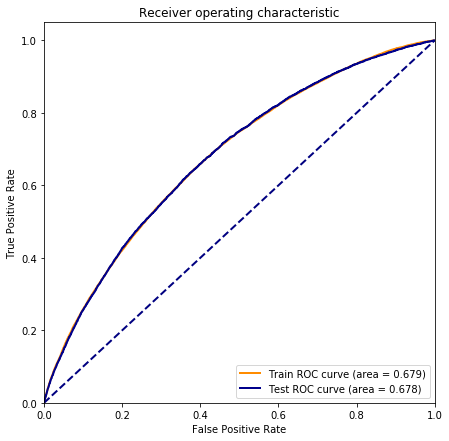

```python
import feather
import os
import warnings
import numpy as np
import pandas as pd
import json
import codecs
import gc 

from pathlib import Path
import matplotlib
import matplotlib.pyplot as plt
import seaborn as sns

from sklearn import metrics

pd.options.display.max_columns = 999
pd.options.display.max_rows = 999

warnings.filterwarnings("ignore")
warnings.filterwarnings("ignore",category=DeprecationWarning)

seed = 666

%matplotlib inline
%load_ext autoreload
%autoreload 2
```

impot transformers and function that I've created in previous notebooks


```python
import helpers
```

# Load data 


```python
data_DIR = Path('/Users/xszpo/Google Drive/DataScience/Projects/201908_credit/'
                '01_data')

df_train = feather.read_dataframe(os.path.join(data_DIR, 'DS_loans_IN_train.feather')).reset_index(drop=True)
df_test = feather.read_dataframe(os.path.join(data_DIR, 'DS_loans_IN_test.feather')).reset_index(drop=True)

df_variables = feather.read_dataframe(os.path.join(data_DIR, 'variables_primary_selection.feather'))

```


```python
with codecs.open(os.path.join(data_DIR, 'replacement_dictionary.json'),'r') as f:
    dict_repl=json.loads(f.read())
    
```

Do some repairs

Convert emp_length to numeric


```python
replacement = {'emp_length':
                  {'< 1 year':0, '9 years':9, '3 years':3, '10+ years':11, '7 years':7,
                   '2 years':2, '4 years':4, '1 year':1, '8 years':8, '5 years':5, None:np.nan,
                   '6 years':6}}
df_train = df_train.replace(replacement)
df_test = df_test.replace(replacement)
```

repair text features


```python
df_train.replace({'desc': {'': np.nan},'emp_title': {'': np.nan},'title': {'': np.nan}}, inplace=True)
df_train.fillna({'desc': 'novalue', 'emp_title': 'novalue', 'title': 'novalue'}, inplace=True)

df_test.replace({'desc': {'': np.nan},'emp_title': {'': np.nan},'title': {'': np.nan}}, inplace=True)
df_test.fillna({'desc': 'novalue', 'emp_title': 'novalue', 'title': 'novalue'}, inplace=True)


```

Select data category

`grade`,`sub_grade`,`int_rate` - are strong features which come from another model and they dominates my model.  I will drop it here and use it in blending step.


```python
target = ['default']
exlude = ['loan_status','grade','int_rate','sub_grade']

features_all_text = ['emp_title','desc','title']
features_all_category = [i for i in df_train.select_dtypes(include=['object']).columns if i not in features_all_text+exlude]
features_all_numeric=  [i for i in df_train.select_dtypes(exclude=['object','datetime64[ns]']).columns if i not in target+exlude]
features_all_data =  list(df_train.select_dtypes(include=['datetime64[ns]']).columns)

print("Text features ({}): {} \n".format(len(features_all_text),", ".join(features_all_text)))
print("Category features ({}): {} \n".format(len(features_all_category),", ".join(features_all_category)))
print("Numeric features ({}): {} \n".format(len(features_all_numeric),", ".join(features_all_numeric)))
print("Datetime features ({}): {} \n".format(len(features_all_data),", ".join(features_all_data)))

```

    Text features (3): emp_title, desc, title 
    
    Category features (10): term, home_ownership, purpose, zip_code, addr_state, initial_list_status, application_type, verification_status_joint, sec_app_earliest_cr_line, disbursement_method 
    
    Numeric features (73): loan_amnt, funded_amnt, installment, emp_length, annual_inc, dti, delinq_2yrs, inq_last_6mths, mths_since_last_delinq, mths_since_last_record, open_acc, pub_rec, revol_bal, revol_util, total_acc, collections_12_mths_ex_med, mths_since_last_major_derog, annual_inc_joint, dti_joint, acc_now_delinq, tot_coll_amt, tot_cur_bal, open_acc_6m, open_act_il, open_il_12m, open_il_24m, mths_since_rcnt_il, total_bal_il, il_util, open_rv_12m, open_rv_24m, max_bal_bc, all_util, total_rev_hi_lim, inq_fi, total_cu_tl, inq_last_12m, acc_open_past_24mths, avg_cur_bal, bc_open_to_buy, bc_util, chargeoff_within_12_mths, delinq_amnt, mo_sin_old_rev_tl_op, mo_sin_rcnt_rev_tl_op, mo_sin_rcnt_tl, mort_acc, mths_since_recent_bc, mths_since_recent_inq, mths_since_recent_revol_delinq, num_accts_ever_120_pd, num_actv_bc_tl, num_actv_rev_tl, num_bc_sats, num_bc_tl, num_il_tl, num_op_rev_tl, num_rev_accts, num_rev_tl_bal_gt_0, num_sats, num_tl_120dpd_2m, num_tl_30dpd, num_tl_90g_dpd_24m, num_tl_op_past_12m, pct_tl_nvr_dlq, percent_bc_gt_75, pub_rec_bankruptcies, tax_liens, tot_hi_cred_lim, total_bal_ex_mort, total_bc_limit, total_il_high_credit_limit, random_value 
    
    Datetime features (2): issue_d, earliest_cr_line 
    


Dataset is too big for my laptop, I reduce it ...


```python
#df_train = df_train_.sample(100000, random_state=seed).reset_index(drop=True)
#df_test = df_test_.sample(50000, random_state=seed).reset_index(drop=True)
```


```python
#!!! RESET INDEX
train_sample_size = 200000
train_sample_size_tune = int(train_sample_size/3)
test_sample_size = 50000
test_sample_size_tune = int(test_sample_size/3)

df_train = df_train.sample(train_sample_size, random_state=seed).reset_index(drop=True)
df_test = df_test.sample(test_sample_size, random_state=seed).reset_index(drop=True)

df_train_tune = df_train.sample(train_sample_size_tune, random_state=seed).reset_index(drop=True)
df_test_tune = df_test.sample(test_sample_size_tune, random_state=seed).reset_index(drop=True)
```


```python
#del(df_train_, df_test_)
#gc.collect()
```

# Models

Some helper functions


```python
def calculate_AUC_prop(pipe, dftrain = df_train, dftest = df_test, target= 'default'):
    y_pred_train = pipe.predict_proba(dftrain)[:,1]
    fpr_train, tpr_train, thresholds_train = metrics.roc_curve(dftrain['default'], y_pred_train, pos_label=1)
    roc_auc_train = metrics.auc(fpr_train, tpr_train)
    print("Train AUC= %.3f"% roc_auc_train)
    
    y_pred_test = pipe.predict_proba(dftest)[:,1]
    fpr_test, tpr_test, thresholds_test = metrics.roc_curve(dftest['default'], y_pred_test, pos_label=1)
    roc_auc_test = metrics.auc(fpr_test, tpr_test)
    print("Test AUC= %.3f"% roc_auc_test)    

    fig, ax = plt.subplots(figsize=(7,7))
    lw = 2
    ax.plot(fpr_train, tpr_train,  color='darkorange',
             lw=lw, label='Train ROC curve (area = %0.3f)' % roc_auc_train)
    ax.plot(fpr_test, tpr_test,  color='darkblue',
             lw=lw, label='Test ROC curve (area = %0.3f)' % roc_auc_test)
    ax.plot([0, 1], [0, 1], color='navy', lw=lw, linestyle='--')
    plt.xlim([0.0, 1.0])
    plt.ylim([0.0, 1.05])
    plt.xlabel('False Positive Rate')
    plt.ylabel('True Positive Rate')
    plt.title('Receiver operating characteristic')
    plt.legend(loc="lower right")
    plt.show
    
    return (roc_auc_train,roc_auc_test)
```


```python
def calculate_AUC_prop_cat(pipe, dftrain, dftest, y_train, y_test):
    y_pred_train = pipe.predict_proba(dftrain)[:,1]
    fpr_train, tpr_train, thresholds_train = metrics.roc_curve(y_train, y_pred_train, pos_label=1)
    roc_auc_train = metrics.auc(fpr_train, tpr_train)
    print("Train AUC= %.3f"% roc_auc_train)
    
    y_pred_test = pipe.predict_proba(dftest)[:,1]
    fpr_test, tpr_test, thresholds_test = metrics.roc_curve(y_test, y_pred_test, pos_label=1)
    roc_auc_test = metrics.auc(fpr_test, tpr_test)
    print("Test AUC= %.3f"% roc_auc_test)    

    fig, ax = plt.subplots(figsize=(7,7))
    lw = 2
    ax.plot(fpr_train, tpr_train,  color='darkorange',
             lw=lw, label='Train ROC curve (area = %0.3f)' % roc_auc_train)
    ax.plot(fpr_test, tpr_test,  color='darkblue',
             lw=lw, label='Test ROC curve (area = %0.3f)' % roc_auc_test)
    ax.plot([0, 1], [0, 1], color='navy', lw=lw, linestyle='--')
    plt.xlim([0.0, 1.0])
    plt.ylim([0.0, 1.05])
    plt.xlabel('False Positive Rate')
    plt.ylabel('True Positive Rate')
    plt.title('Receiver operating characteristic')
    plt.legend(loc="lower right")
    plt.show
    
    return (roc_auc_train,roc_auc_test)
```


```python
def calculate_AUC_blend(y_pred_train, y_pred_test, y_train, y_test):
    fpr_train, tpr_train, thresholds_train = metrics.roc_curve(y_train, y_pred_train, pos_label=1)
    roc_auc_train = metrics.auc(fpr_train, tpr_train)
    print("Train AUC= %.3f"% roc_auc_train)
    
    fpr_test, tpr_test, thresholds_test = metrics.roc_curve(y_test, y_pred_test, pos_label=1)
    roc_auc_test = metrics.auc(fpr_test, tpr_test)
    print("Test AUC= %.3f"% roc_auc_test)    

    fig, ax = plt.subplots(figsize=(7,7))
    lw = 2
    ax.plot(fpr_train, tpr_train,  color='darkorange',
             lw=lw, label='Train ROC curve (area = %0.3f)' % roc_auc_train)
    ax.plot(fpr_test, tpr_test,  color='darkblue',
             lw=lw, label='Test ROC curve (area = %0.3f)' % roc_auc_test)
    ax.plot([0, 1], [0, 1], color='navy', lw=lw, linestyle='--')
    plt.xlim([0.0, 1.0])
    plt.ylim([0.0, 1.05])
    plt.xlabel('False Positive Rate')
    plt.ylabel('True Positive Rate')
    plt.title('Receiver operating characteristic')
    plt.legend(loc="lower right")
    plt.show
    
    return (roc_auc_train,roc_auc_test)
```


```python
def select_alpha_LR(alpha, Xtrain,Xtest,Ytrain,Ytest, pipe, model_name='logisticregression'):
    pipe.named_steps[model_name].C = alpha
    pipe.named_steps[model_name].fit(Xtrain, Ytrain)
    y_pred_train = pipe.named_steps[model_name].predict_proba(Xtrain)[:,1]
    y_pred_test = pipe.named_steps[model_name].predict_proba(Xtest)[:,1]

    fpr_train, tpr_train, thresholds_train = metrics.roc_curve(Ytrain, y_pred_train, pos_label=1)
    roc_auc_train = metrics.auc(fpr_train, tpr_train)
    fpr_test, tpr_test, thresholds_test = metrics.roc_curve(Ytest, y_pred_test, pos_label=1)
    roc_auc_test = metrics.auc(fpr_test, tpr_test)

    nbr_features = len([i for i in zip(pipe.named_steps[model_name].coef_[0],
                        pipe.named_steps['columntransformer'].get_feature_names()) if i[0]>0])
    features = [i[1] for i in zip(pipe.named_steps[model_name].coef_[0],
                        pipe.named_steps['columntransformer'].get_feature_names()) if i[0]>0]

    return {'C':alpha,'roc_auc_train':roc_auc_train,'roc_auc_test':roc_auc_test, 
            'nbr_features':nbr_features} #,'features':features }


```

## Logistic LASSO regression


```python
from itertools import compress
from sklearn.pipeline import make_pipeline, make_union
from sklearn.compose import ColumnTransformer
from category_encoders import WOEEncoder, OneHotEncoder,TargetEncoder
from sklearn.feature_extraction.text import CountVectorizer, TfidfVectorizer

from sklearn.linear_model import Lasso, Ridge, LogisticRegression
from sklearn import metrics
import eli5
from sklearn.decomposition import TruncatedSVD
from sklearn.decomposition import LatentDirichletAllocation

seed = 666
```


```python
manual_bins = {'acc_open_past_24mths': {'bins': [3, 9]},
 'int_rate': {'bins': [12, 20]},
 'avg_cur_bal': {'bins': [10000, 30000]},
 'dti': {'bins': [10, 33]},
 'emp_length': {},
 'annual_inc': {'bins': [125000]},
 'mo_sin_old_rev_tl_op': {},
 'bc_util': {},
 'mort_acc': {},
 'tot_cur_bal': {'bins': [20000, 130000]},
 'bc_open_to_buy': {'bins': [5000, 2000]},
 'mths_since_recent_bc': {},
 'total_bc_limit': {'bins': [30000, 60000]},
 'loan_amnt': {}}
```


```python
import helpers
```


```python
pipe_212_lasso = make_pipeline(
    ColumnTransformer([
        ('numeric', helpers.DecisionTreeDiscretizer_DF(bins = manual_bins,
            max_depth = 3, min_samples_prc_leaf=0.05),features_all_numeric),
        ('category',helpers.PassThroughOrReplace(fillna=True, replace_dict=dict_repl),features_all_category)
    ]),
    WOEEncoder(random_state=seed),
    LogisticRegression(random_state=seed, C=0.05, penalty='l1')
    )
```


```python
%%time
pipe_212_lasso.fit(df_train_tune, df_train_tune.default)
```

    CPU times: user 13.5 s, sys: 1.1 s, total: 14.6 s
    Wall time: 14.8 s


    Pipeline(memory=None,
             steps=[('columntransformer',
                     ColumnTransformer(n_jobs=None, remainder='drop',
                                       sparse_threshold=0.3,
                                       transformer_weights=None,
                                       transformers=[('numeric',
                                                      DecisionTreeDiscretizer_DF(bins={'acc_open_past_24mths': {'bins': [3,
                                                                                                                         9]},
                                                                                       'annual_inc': {'bins': [125000]},
                                                                                       'avg_cur_bal': {'bins': [10000,
                                                                                                                30000]},
                                                                                       'bc_open_to_buy': {'bins': [5000,
                                                                                                                   2000]},
                                                                                       'bc_ut...
                                handle_unknown='value', random_state=666,
                                randomized=False, regularization=1.0,
                                return_df=True, sigma=0.05, verbose=0)),
                    ('logisticregression',
                     LogisticRegression(C=0.05, class_weight=None, dual=False,
                                        fit_intercept=True, intercept_scaling=1,
                                        l1_ratio=None, max_iter=100,
                                        multi_class='warn', n_jobs=None,
                                        penalty='l1', random_state=666,
                                        solver='warn', tol=0.0001, verbose=0,
                                        warm_start=False))],
             verbose=False)


```python
_x_tr = pipe_212_lasso.named_steps['woeencoder'].transform(pipe_212_lasso.named_steps['columntransformer'].transform(df_train_tune))
_x_tst = pipe_212_lasso.named_steps['woeencoder'].transform(pipe_212_lasso.named_steps['columntransformer'].transform(df_test_tune))

```


```python
%%time

list_alpha = list((np.array([1/(10**i) for i in range(1,6)]).reshape(-1,1)*np.array([8,5,3,1]).reshape(1,-1)).reshape(-1))

wyniki = [select_alpha_LR(alpha = i, Xtrain=_x_tr,Xtest=_x_tst,Ytrain=df_train_tune['default'],Ytest=df_test_tune['default'],
             pipe = pipe_212_lasso, model_name='logisticregression') for i in list_alpha]

wyn = pd.DataFrame(wyniki)
wyn['C_log'] = np.log(wyn.C)

fig, ax = plt.subplots(figsize=(10,4))
sns.lineplot(x='C_log', 
             y='roc_auc_train',
             color='r',
             data=wyn,
             ax=ax)
sns.lineplot(x='C_log', 
             y='roc_auc_test', 
             color='b',
             data=wyn,
             ax=ax)   
ax.legend(['train', 'test'], facecolor='w')
[ax.text(p[0], 0.53, "'"+str(p[2])+"'", color='black') for p in zip(wyn.C_log.to_list(), wyn.roc_auc_train.to_list(), wyn.nbr_features.to_list())]

plt.show()
          
```


    CPU times: user 17.9 s, sys: 2.21 s, total: 20.1 s
    Wall time: 19.9 s


```python
wyn.query("C_log <0 & C_log>-6")
```


<div>
<style scoped>
    .dataframe tbody tr th:only-of-type {
        vertical-align: middle;
    }

    .dataframe tbody tr th {
        vertical-align: top;
    }

    .dataframe thead th {
        text-align: right;
    }
</style>
<table border="1" class="dataframe">
  <thead>
    <tr style="text-align: right;">
      <th></th>
      <th>C</th>
      <th>roc_auc_train</th>
      <th>roc_auc_test</th>
      <th>nbr_features</th>
      <th>C_log</th>
    </tr>
  </thead>
  <tbody>
    <tr>
      <th>0</th>
      <td>0.800</td>
      <td>0.692734</td>
      <td>0.678531</td>
      <td>45</td>
      <td>-0.223144</td>
    </tr>
    <tr>
      <th>1</th>
      <td>0.500</td>
      <td>0.692555</td>
      <td>0.678608</td>
      <td>44</td>
      <td>-0.693147</td>
    </tr>
    <tr>
      <th>2</th>
      <td>0.300</td>
      <td>0.692209</td>
      <td>0.678694</td>
      <td>43</td>
      <td>-1.203973</td>
    </tr>
    <tr>
      <th>3</th>
      <td>0.100</td>
      <td>0.690045</td>
      <td>0.677758</td>
      <td>36</td>
      <td>-2.302585</td>
    </tr>
    <tr>
      <th>4</th>
      <td>0.080</td>
      <td>0.689149</td>
      <td>0.677385</td>
      <td>36</td>
      <td>-2.525729</td>
    </tr>
    <tr>
      <th>5</th>
      <td>0.050</td>
      <td>0.686203</td>
      <td>0.675943</td>
      <td>27</td>
      <td>-2.995732</td>
    </tr>
    <tr>
      <th>6</th>
      <td>0.030</td>
      <td>0.683694</td>
      <td>0.674139</td>
      <td>23</td>
      <td>-3.506558</td>
    </tr>
    <tr>
      <th>7</th>
      <td>0.010</td>
      <td>0.674819</td>
      <td>0.665932</td>
      <td>20</td>
      <td>-4.605170</td>
    </tr>
    <tr>
      <th>8</th>
      <td>0.008</td>
      <td>0.671617</td>
      <td>0.662898</td>
      <td>17</td>
      <td>-4.828314</td>
    </tr>
    <tr>
      <th>9</th>
      <td>0.005</td>
      <td>0.658014</td>
      <td>0.649920</td>
      <td>13</td>
      <td>-5.298317</td>
    </tr>
    <tr>
      <th>10</th>
      <td>0.003</td>
      <td>0.640366</td>
      <td>0.630862</td>
      <td>4</td>
      <td>-5.809143</td>
    </tr>
  </tbody>
</table>
</div>


```python
pipe_212_lasso = make_pipeline(
    ColumnTransformer([
        ('numeric', helpers.DecisionTreeDiscretizer_DF(bins = manual_bins,
            max_depth = 3, min_samples_prc_leaf=0.05),features_all_numeric),
        ('category',helpers.PassThroughOrReplace(fillna=True, replace_dict=dict_repl),features_all_category)
    ]),
    WOEEncoder(random_state=seed),
    LogisticRegression(random_state=seed, C=0.01, penalty='l1')
    )
```


```python
%%time
pipe_212_lasso.fit(df_train, df_train.default)
```

    CPU times: user 40.8 s, sys: 3.83 s, total: 44.6 s
    Wall time: 47.2 s


    Pipeline(memory=None,
             steps=[('columntransformer',
                     ColumnTransformer(n_jobs=None, remainder='drop',
                                       sparse_threshold=0.3,
                                       transformer_weights=None,
                                       transformers=[('numeric',
                                                      DecisionTreeDiscretizer_DF(bins={'acc_open_past_24mths': {'bins': [3,
                                                                                                                         9]},
                                                                                       'annual_inc': {'bins': [125000]},
                                                                                       'avg_cur_bal': {'bins': [10000,
                                                                                                                30000]},
                                                                                       'bc_open_to_buy': {'bins': [5000,
                                                                                                                   2000]},
                                                                                       'bc_ut...
                                handle_unknown='value', random_state=666,
                                randomized=False, regularization=1.0,
                                return_df=True, sigma=0.05, verbose=0)),
                    ('logisticregression',
                     LogisticRegression(C=0.01, class_weight=None, dual=False,
                                        fit_intercept=True, intercept_scaling=1,
                                        l1_ratio=None, max_iter=100,
                                        multi_class='warn', n_jobs=None,
                                        penalty='l1', random_state=666,
                                        solver='warn', tol=0.0001, verbose=0,
                                        warm_start=False))],
             verbose=False)


```python
len([i for i in zip(pipe_212_lasso.named_steps['logisticregression'].coef_[0],
                    pipe_212_lasso.named_steps['columntransformer'].get_feature_names()) if i[0]>0])
```


    24


```python
%%time
calculate_AUC_prop(pipe_212_lasso, dftrain = df_train, dftest = df_test)
```

    Train AUC= 0.679
    Test AUC= 0.678
    CPU times: user 16 s, sys: 1.43 s, total: 17.4 s
    Wall time: 18.1 s


    (0.6785377846539303, 0.6783104479031097)





```python
eli5.show_weights(pipe_212_lasso.named_steps['logisticregression'], 
                  feature_names = pipe_212_lasso.named_steps['columntransformer'].get_feature_names(),
                 top=31)
```


    <style>
    table.eli5-weights tr:hover {
        filter: brightness(85%);
    }
</style>


    

    

    

    

    

    


    

    

    

    
        

    

        
            
                
                
    
        <p style="margin-bottom: 0.5em; margin-top: 0em">
            <b>
    
        y=1
    
</b>

top features
        </p>
    
    <table class="eli5-weights"
           style="border-collapse: collapse; border: none; margin-top: 0em; table-layout: auto; margin-bottom: 2em;">
        <thead>
        <tr style="border: none;">
            
                <th style="padding: 0 1em 0 0.5em; text-align: right; border: none;" title="Feature weights. Note that weights do not account for feature value scales, so if feature values have different scales, features with highest weights might not be the most important.">
                    Weight<sup>?</sup>
                </th>
            
            <th style="padding: 0 0.5em 0 0.5em; text-align: left; border: none;">Feature</th>
            
        </tr>
        </thead>
        <tbody>
        
            <tr style="background-color: hsl(120, 100.00%, 83.81%); border: none;">
    <td style="padding: 0 1em 0 0.5em; text-align: right; border: none;">
        +1.034
    </td>
    <td style="padding: 0 0.5em 0 0.5em; text-align: left; border: none;">
        category__term
    </td>
    
</tr>
        
            <tr style="background-color: hsl(120, 100.00%, 87.78%); border: none;">
    <td style="padding: 0 1em 0 0.5em; text-align: right; border: none;">
        +0.691
    </td>
    <td style="padding: 0 0.5em 0 0.5em; text-align: left; border: none;">
        numeric__emp_length
    </td>
    
</tr>
        
            <tr style="background-color: hsl(120, 100.00%, 88.06%); border: none;">
    <td style="padding: 0 1em 0 0.5em; text-align: right; border: none;">
        +0.668
    </td>
    <td style="padding: 0 0.5em 0 0.5em; text-align: left; border: none;">
        category__purpose
    </td>
    
</tr>
        
            <tr style="background-color: hsl(120, 100.00%, 88.41%); border: none;">
    <td style="padding: 0 1em 0 0.5em; text-align: right; border: none;">
        +0.641
    </td>
    <td style="padding: 0 0.5em 0 0.5em; text-align: left; border: none;">
        numeric__inq_last_6mths
    </td>
    
</tr>
        
            <tr style="background-color: hsl(120, 100.00%, 88.85%); border: none;">
    <td style="padding: 0 1em 0 0.5em; text-align: right; border: none;">
        +0.606
    </td>
    <td style="padding: 0 0.5em 0 0.5em; text-align: left; border: none;">
        numeric__tot_hi_cred_lim
    </td>
    
</tr>
        
            <tr style="background-color: hsl(120, 100.00%, 89.99%); border: none;">
    <td style="padding: 0 1em 0 0.5em; text-align: right; border: none;">
        +0.520
    </td>
    <td style="padding: 0 0.5em 0 0.5em; text-align: left; border: none;">
        category__home_ownership
    </td>
    
</tr>
        
            <tr style="background-color: hsl(120, 100.00%, 90.36%); border: none;">
    <td style="padding: 0 1em 0 0.5em; text-align: right; border: none;">
        +0.493
    </td>
    <td style="padding: 0 0.5em 0 0.5em; text-align: left; border: none;">
        numeric__dti
    </td>
    
</tr>
        
            <tr style="background-color: hsl(120, 100.00%, 90.37%); border: none;">
    <td style="padding: 0 1em 0 0.5em; text-align: right; border: none;">
        +0.492
    </td>
    <td style="padding: 0 0.5em 0 0.5em; text-align: left; border: none;">
        numeric__acc_open_past_24mths
    </td>
    
</tr>
        
            <tr style="background-color: hsl(120, 100.00%, 90.45%); border: none;">
    <td style="padding: 0 1em 0 0.5em; text-align: right; border: none;">
        +0.486
    </td>
    <td style="padding: 0 0.5em 0 0.5em; text-align: left; border: none;">
        numeric__total_rev_hi_lim
    </td>
    
</tr>
        
            <tr style="background-color: hsl(120, 100.00%, 90.91%); border: none;">
    <td style="padding: 0 1em 0 0.5em; text-align: right; border: none;">
        +0.453
    </td>
    <td style="padding: 0 0.5em 0 0.5em; text-align: left; border: none;">
        numeric__num_tl_op_past_12m
    </td>
    
</tr>
        
            <tr style="background-color: hsl(120, 100.00%, 91.88%); border: none;">
    <td style="padding: 0 1em 0 0.5em; text-align: right; border: none;">
        +0.385
    </td>
    <td style="padding: 0 0.5em 0 0.5em; text-align: left; border: none;">
        numeric__mo_sin_old_rev_tl_op
    </td>
    
</tr>
        
            <tr style="background-color: hsl(120, 100.00%, 92.27%); border: none;">
    <td style="padding: 0 1em 0 0.5em; text-align: right; border: none;">
        +0.359
    </td>
    <td style="padding: 0 0.5em 0 0.5em; text-align: left; border: none;">
        numeric__revol_util
    </td>
    
</tr>
        
            <tr style="background-color: hsl(120, 100.00%, 92.82%); border: none;">
    <td style="padding: 0 1em 0 0.5em; text-align: right; border: none;">
        +0.323
    </td>
    <td style="padding: 0 0.5em 0 0.5em; text-align: left; border: none;">
        numeric__installment
    </td>
    
</tr>
        
            <tr style="background-color: hsl(120, 100.00%, 92.96%); border: none;">
    <td style="padding: 0 1em 0 0.5em; text-align: right; border: none;">
        +0.314
    </td>
    <td style="padding: 0 0.5em 0 0.5em; text-align: left; border: none;">
        numeric__bc_open_to_buy
    </td>
    
</tr>
        
            <tr style="background-color: hsl(120, 100.00%, 93.39%); border: none;">
    <td style="padding: 0 1em 0 0.5em; text-align: right; border: none;">
        +0.287
    </td>
    <td style="padding: 0 0.5em 0 0.5em; text-align: left; border: none;">
        category__addr_state
    </td>
    
</tr>
        
            <tr style="background-color: hsl(120, 100.00%, 93.57%); border: none;">
    <td style="padding: 0 1em 0 0.5em; text-align: right; border: none;">
        +0.276
    </td>
    <td style="padding: 0 0.5em 0 0.5em; text-align: left; border: none;">
        numeric__mths_since_recent_bc
    </td>
    
</tr>
        
            <tr style="background-color: hsl(120, 100.00%, 94.23%); border: none;">
    <td style="padding: 0 1em 0 0.5em; text-align: right; border: none;">
        +0.237
    </td>
    <td style="padding: 0 0.5em 0 0.5em; text-align: left; border: none;">
        numeric__num_rev_tl_bal_gt_0
    </td>
    
</tr>
        
            <tr style="background-color: hsl(120, 100.00%, 94.43%); border: none;">
    <td style="padding: 0 1em 0 0.5em; text-align: right; border: none;">
        +0.225
    </td>
    <td style="padding: 0 0.5em 0 0.5em; text-align: left; border: none;">
        numeric__percent_bc_gt_75
    </td>
    
</tr>
        
            <tr style="background-color: hsl(120, 100.00%, 94.82%); border: none;">
    <td style="padding: 0 1em 0 0.5em; text-align: right; border: none;">
        +0.203
    </td>
    <td style="padding: 0 0.5em 0 0.5em; text-align: left; border: none;">
        numeric__bc_util
    </td>
    
</tr>
        
            <tr style="background-color: hsl(120, 100.00%, 95.81%); border: none;">
    <td style="padding: 0 1em 0 0.5em; text-align: right; border: none;">
        +0.150
    </td>
    <td style="padding: 0 0.5em 0 0.5em; text-align: left; border: none;">
        numeric__mort_acc
    </td>
    
</tr>
        
            <tr style="background-color: hsl(120, 100.00%, 97.34%); border: none;">
    <td style="padding: 0 1em 0 0.5em; text-align: right; border: none;">
        +0.078
    </td>
    <td style="padding: 0 0.5em 0 0.5em; text-align: left; border: none;">
        numeric__num_actv_rev_tl
    </td>
    
</tr>
        
            <tr style="background-color: hsl(120, 100.00%, 97.54%); border: none;">
    <td style="padding: 0 1em 0 0.5em; text-align: right; border: none;">
        +0.070
    </td>
    <td style="padding: 0 0.5em 0 0.5em; text-align: left; border: none;">
        numeric__mths_since_last_delinq
    </td>
    
</tr>
        
            <tr style="background-color: hsl(120, 100.00%, 98.97%); border: none;">
    <td style="padding: 0 1em 0 0.5em; text-align: right; border: none;">
        +0.020
    </td>
    <td style="padding: 0 0.5em 0 0.5em; text-align: left; border: none;">
        numeric__mo_sin_rcnt_tl
    </td>
    
</tr>
        
            <tr style="background-color: hsl(120, 100.00%, 99.05%); border: none;">
    <td style="padding: 0 1em 0 0.5em; text-align: right; border: none;">
        +0.018
    </td>
    <td style="padding: 0 0.5em 0 0.5em; text-align: left; border: none;">
        numeric__mths_since_recent_inq
    </td>
    
</tr>
        
        

        
        
            <tr style="background-color: hsl(0, 100.00%, 96.73%); border: none;">
    <td style="padding: 0 1em 0 0.5em; text-align: right; border: none;">
        -0.105
    </td>
    <td style="padding: 0 0.5em 0 0.5em; text-align: left; border: none;">
        category__zip_code
    </td>
    
</tr>
        
            <tr style="background-color: hsl(0, 100.00%, 80.00%); border: none;">
    <td style="padding: 0 1em 0 0.5em; text-align: right; border: none;">
        -1.397
    </td>
    <td style="padding: 0 0.5em 0 0.5em; text-align: left; border: none;">
        &lt;BIAS&gt;
    </td>
    
</tr>
        

        </tbody>
    </table>

            
        

        


    

    

    

    


    

    

    

    

    

    


    

    

    

    

    

    


## Neutral network


```python
#df_train = df_train_.sample(300000, random_state=seed).reset_index(drop=True)
#df_test = df_test_.sample(100000, random_state=seed).reset_index(drop=True)
```


```python
gc.collect()
```


    5419


```python
from sklearn.pipeline import make_pipeline, make_union
from sklearn.compose import ColumnTransformer
from sklearn.preprocessing import StandardScaler, Normalizer, MinMaxScaler
from category_encoders import OneHotEncoder, TargetEncoder
from sklearn.linear_model import Lasso, Ridge
from sklearn import metrics
import eli5

from category_encoders import OrdinalEncoder
import helpers

seed = 666
```


```python
import tensorflow as tf
from sklearn.metrics import roc_auc_score

def auroc(y_true, y_pred):
    return tf.py_func(roc_auc_score, (y_true, y_pred), tf.double)
```


```python
from keras.models import Sequential,Model
from keras.layers import Dense, Activation, InputLayer, BatchNormalization, Dropout
from keras.wrappers.scikit_learn import KerasClassifier, KerasRegressor
from keras.initializers import glorot_normal
from keras.engine.input_layer import Input
from keras.optimizers import Adam, SGD

opt = SGD(lr=0.01, momentum=0.9)

# For custom metrics
import keras.backend as K


def create_model():
    model_in = Input(shape=(83,), dtype='float32', sparse=False)
    out = Dense(192, activation='relu')(model_in)
    out = Dropout(0.2)(out)
    out = Dense(64, activation='relu')(out)
    out = Dropout(0.2)(out)
    out = Dense(1, activation='sigmoid')(out)
    model = Model(model_in, out)
    model.compile(loss='binary_crossentropy', optimizer=opt, metrics=['accuracy', auroc])
    return model
```

    Using TensorFlow backend.


```python
exclude = []
pipe_221_nn = make_pipeline(
    ColumnTransformer([
        ('numeric', helpers.PassThroughOrReplace(fillna=True, replace_dict=dict_repl),
         [i for i in features_all_numeric if i not in exclude]),
        ('category',TargetEncoder(),[i for i in features_all_category if i not in exclude])
    ]),
    StandardScaler(),
    KerasClassifier(build_fn=create_model, epochs=10, batch_size=64, verbose=1)
    )
```


```python
%%time
pipe_221_nn.fit(df_train, df_train.default)
```

    Epoch 1/10
    200000/200000 [==============================] - 11s 54us/step - loss: 0.4375 - acc: 0.8250 - auroc: 0.6734
    Epoch 2/10
    200000/200000 [==============================] - 13s 65us/step - loss: 0.4284 - acc: 0.8259 - auroc: 0.6937
    Epoch 3/10
    200000/200000 [==============================] - 15s 73us/step - loss: 0.4265 - acc: 0.8255 - auroc: 0.6986
    Epoch 4/10
    200000/200000 [==============================] - 12s 59us/step - loss: 0.4252 - acc: 0.8261 - auroc: 0.7029
    Epoch 5/10
    200000/200000 [==============================] - 11s 56us/step - loss: 0.4241 - acc: 0.8262 - auroc: 0.7056
    Epoch 6/10
    200000/200000 [==============================] - 14s 70us/step - loss: 0.4230 - acc: 0.8261 - auroc: 0.7070 0s - loss: 0.4227 - acc: 0.8264
    Epoch 7/10
    200000/200000 [==============================] - 14s 69us/step - loss: 0.4226 - acc: 0.8263 - auroc: 0.7080
    Epoch 8/10
    200000/200000 [==============================] - 14s 68us/step - loss: 0.4220 - acc: 0.8260 - auroc: 0.7098
    Epoch 9/10
    200000/200000 [==============================] - 10s 52us/step - loss: 0.4215 - acc: 0.8263 - auroc: 0.7123
    Epoch 10/10
    200000/200000 [==============================] - 11s 55us/step - loss: 0.4204 - acc: 0.8264 - auroc: 0.7138
    CPU times: user 2min 42s, sys: 11.9 s, total: 2min 54s
    Wall time: 2min 7s


    Pipeline(memory=None,
             steps=[('columntransformer',
                     ColumnTransformer(n_jobs=None, remainder='drop',
                                       sparse_threshold=0.3,
                                       transformer_weights=None,
                                       transformers=[('numeric',
                                                      PassThroughOrReplace(fillna=True,
                                                                           replace_dict={'zip_code': {'007xx': 3,
                                                                                                      '008xx': 4,
                                                                                                      '009xx': 2,
                                                                                                      '010xx': 1,
                                                                                                      '011xx': 0,
                                                                                                      '012xx': 1,
                                                                                                      '013xx': 1,
                                                                                                      '014xx': 1,
                                                                                                      '015xx': 1,
                                                                                                      '016xx': 1,
                                                                                                      '017xx': 3,
                                                                                                      '018xx': 1,
                                                                                                      '019...
                                                      ['term', 'home_ownership',
                                                       'purpose', 'zip_code',
                                                       'addr_state',
                                                       'initial_list_status',
                                                       'application_type',
                                                       'verification_status_joint',
                                                       'sec_app_earliest_cr_line',
                                                       'disbursement_method'])],
                                       verbose=False)),
                    ('standardscaler',
                     StandardScaler(copy=True, with_mean=True, with_std=True)),
                    ('kerasclassifier',
                     <keras.wrappers.scikit_learn.KerasClassifier object at 0x126239b90>)],
             verbose=False)


NOTE - need more data to train and better hardware, nevertheless I think that data doest have the information to prepare good predictions 


```python
%%time
calculate_AUC_prop(pipe_221_nn, dftrain = df_train, dftest = df_test)
```

    200000/200000 [==============================] - 2s 8us/step
    Train AUC= 0.724
    50000/50000 [==============================] - 0s 9us/step
    Test AUC= 0.700
    CPU times: user 3.39 s, sys: 488 ms, total: 3.88 s
    Wall time: 3.21 s


    (0.7240470798550231, 0.7003267284424176)


## CatBoost + Scikit-Optimize

Scikit-Optimize part is in another notebook: Google Collab (GPU) `05_model_collab_GPU.ipynb`

```
CatBoost took 405.34 seconds,  candidates checked: 1, best CV score: 0.700 ± 0.001
Best parameters:
{'bagging_temperature': 0.5931923511642098,
 'border_count': 52,
 'depth': 6,
 'iterations': 70,
 'l2_leaf_reg': 14,
 'learning_rate': 0.9473066099743538,
 'random_strength': 7.63131053187394e-07,
 'scale_pos_weight': 1.3052104983649078}
 ```


```python
from catboost import CatBoostClassifier, Pool
from sklearn import metrics

```


```python
df_train_c = df_train.copy()
df_test_c = df_test.copy()
```


```python
# convert text to category 
for col in features_all_category:
    df_train_c[col] = df_train_c[col].replace([' '],['nocat']).fillna('nocat').astype('category')

for col in features_all_category:
    df_test_c[col] = df_test_c[col].replace([' '],['nocat']).fillna('nocat').astype('category')

```


```python
train_pool = Pool(data=df_train_c[features_all_category+features_all_numeric], 
                  label=df_train_c.default.to_list(), cat_features=features_all_category)

test_pool = Pool(data=df_test_c[features_all_category+features_all_numeric],
                 label=df_test_c.default.to_list(), cat_features=features_all_category)

```

params from Google Collab - `05_model_collab_GPU.ipynb`


```python
param = {'bagging_temperature': 0.5434030676903125,
 'depth': 7,
 'iterations': 154,
 'l2_leaf_reg': 25,
 'learning_rate': 0.04447541043186938,
 'random_strength': 3.245977736555784e-09,
 'scale_pos_weight': 0.5750700246521092}
```


```python
cat_cls = CatBoostClassifier(**param, loss_function='Logloss',
                         custom_metric = ['Logloss', 'AUC'],
                         cat_features = features_all_category,
                         verbose = False)
```


```python
import operator
fi = []
for i in zip(train_pool.get_feature_names(),cat_cls.get_feature_importance(type='PredictionValuesChange')):
    fi += [{"name":i[0],"PredictionValuesChange":i[1]}]
    
pd.DataFrame(fi).sort_values("PredictionValuesChange",ascending=False).head(30).plot.bar(x='name', y='PredictionValuesChange', figsize =(10,6))

```


    <matplotlib.axes._subplots.AxesSubplot at 0x161d30a90>


```python
%%time

cat_cls.fit(train_pool)
```

    CPU times: user 1min 51s, sys: 7.35 s, total: 1min 59s
    Wall time: 41.1 s


    <catboost.core.CatBoostClassifier at 0x127074dd0>


```python
calculate_AUC_prop_cat(cat_cls, train_pool, test_pool, df_train.default.to_list(), df_test.default.to_list())
```

    Train AUC= 0.711
    Test AUC= 0.701


    (0.71132563060825, 0.7010904231669306)


NOTE - need more data to train and better hardware, nevertheless I think that data doest have the information to prepare good predictions 

# Blend


```python
LC_model = df_train.groupby(['sub_grade'])[['default']].mean()
def_rate_by_sub_grade= {}
for i in LC_model.itertuples():
    def_rate_by_sub_grade[i.Index]= i.default
    
def LC_model_predict(df):
    return df.sub_grade.replace(def_rate_by_sub_grade).to_list()


```


```python
%%time
tr_lc_model = LC_model_predict(df_train)
tr_212 = pipe_212_lasso.predict_proba(df_train)[:,1]
tr_221 = pipe_221_nn.predict_proba(df_train)[:,1]
tr_cat = cat_cls.predict_proba(train_pool)[:,1]

te_lc_model = LC_model_predict(df_test)
te_212 = pipe_212_lasso.predict_proba(df_test)[:,1]
te_221 = pipe_221_nn.predict_proba(df_test)[:,1]
te_cat = cat_cls.predict_proba(test_pool)[:,1]
```

    200000/200000 [==============================] - 2s 9us/step
    50000/50000 [==============================] - 0s 7us/step
    CPU times: user 19.8 s, sys: 1.98 s, total: 21.8 s
    Wall time: 21.3 s


```python
tr_lc_model = LC_model_predict(df_train)
te_lc_model = LC_model_predict(df_test)


```


```python
y_train_pred = np.array([tr_lc_model,tr_212,tr_221, tr_cat])
y_test_pred = np.array([te_lc_model,te_212,te_221, te_cat])

```


```python
from scipy.special import softmax
from scipy.optimize import minimize


def roc_optimaize(x):
    
    x=softmax(np.abs(x))
    blend_weights = x.reshape(-1,1)
    #y_train_pred_blend = (y_train_pred * blend_weights).sum(axis=0)
    y_test_pred_blend = (y_test_pred * blend_weights).sum(axis=0)

    fpr_test, tpr_test, thresholds_test = metrics.roc_curve(df_test.default.to_list(), y_test_pred_blend, pos_label=1)
    roc_auc_test = metrics.auc(fpr_test, tpr_test)
    return roc_auc_test*(-1)


nbr = y_train_pred.shape[0]
wsp = [None for i in range(nbr)]
for i in range(nbr):
    wsp[i] = round(1/nbr,4)

x0 = np.array(wsp)

```


```python
#https://docs.scipy.org/doc/scipy/reference/tutorial/optimize.html
res = minimize(roc_optimaize, x0, method='nelder-mead',
               options={'xtol': 1e-8, 'disp': True})
```

    Optimization terminated successfully.
             Current function value: -0.711485
             Iterations: 153
             Function evaluations: 334


```python
blend_weights = np.array(softmax(np.abs(res.x))).reshape(-1,1)
```


```python
print(np.round(blend_weights,4))
```

    [[0.3127]
     [0.077 ]
     [0.3843]
     [0.226 ]]


```python
y_train_pred_blend = (y_train_pred * blend_weights).sum(axis=0)
y_test_pred_blend = (y_test_pred * blend_weights).sum(axis=0)
```


```python
calculate_AUC_blend(y_train_pred_blend, y_test_pred_blend, df_train.default.to_list(), df_test.default.to_list())

```

    Train AUC= 0.725
    Test AUC= 0.711


    (0.7248367156946158, 0.711484927488223)


